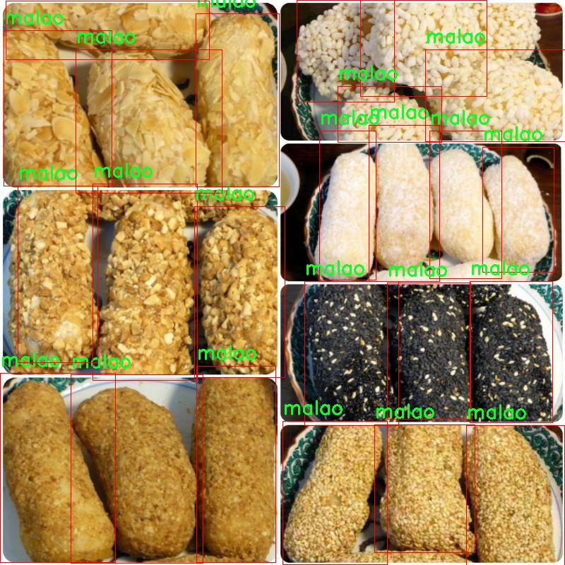

# 改进yolo11-efficientViT等200+全套创新点大全：食品物品检测系统源码＆数据集全套

### 1.图片效果展示


##### 项目来源 **[人工智能促进会 2024.11.01](https://kdocs.cn/l/cszuIiCKVNis)**

注意：由于项目一直在更新迭代，上面“1.图片效果展示”和“2.视频效果展示”展示的系统图片或者视频可能为老版本，新版本在老版本的基础上升级如下：（实际效果以升级的新版本为准）

  （1）适配了YOLOV11的“目标检测”模型和“实例分割”模型，通过加载相应的权重（.pt）文件即可自适应加载模型。

  （2）支持“图片识别”、“视频识别”、“摄像头实时识别”三种识别模式。

  （3）支持“图片识别”、“视频识别”、“摄像头实时识别”三种识别结果保存导出，解决手动导出（容易卡顿出现爆内存）存在的问题，识别完自动保存结果并导出到tempDir中。

  （4）支持Web前端系统中的标题、背景图等自定义修改。

  另外本项目提供训练的数据集和训练教程,暂不提供权重文件（best.pt）,需要您按照教程进行训练后实现图片演示和Web前端界面演示的效果。

### 2.视频效果展示

[2.1 视频效果展示](https://www.bilibili.com/video/BV1CDSXYpEaM/)

### 3.背景

研究背景与意义

随着全球食品安全问题的日益严重，食品物品的检测与识别成为了现代社会亟待解决的重要课题。食品安全不仅关乎消费者的健康与安全，也直接影响到食品产业的可持续发展。因此，开发高效、准确的食品物品检测系统显得尤为重要。近年来，深度学习技术的迅猛发展为物体检测领域带来了新的机遇，尤其是YOLO（You Only Look Once）系列模型因其高效性和实时性而受到广泛关注。YOLOv11作为该系列的最新版本，具备更强的特征提取能力和更快的处理速度，为食品物品的自动检测提供了新的可能性。

本研究旨在基于改进的YOLOv11模型，构建一个高效的食品物品检测系统。所使用的数据集包含1300张图像，涵盖了多种食品类别，如水果、饮料、零食等。这些类别的多样性为模型的训练提供了丰富的样本，有助于提高检测的准确性和鲁棒性。通过对数据集的深入分析与处理，结合YOLOv11的先进算法，我们期望能够实现对不同食品物品的快速、准确识别，从而为食品安全监测、智能购物等应用场景提供技术支持。

此外，改进YOLOv11模型的研究不仅能够推动食品物品检测技术的发展，还能为其他领域的物体检测提供借鉴。通过不断优化算法和模型结构，我们希望能够在提高检测精度的同时，降低计算资源的消耗，使得该系统能够在移动设备和边缘计算环境中高效运行。这一研究不仅具有重要的学术价值，也将为实际应用提供切实可行的解决方案，推动食品安全管理的智能化进程。

### 4.数据集信息展示

##### 4.1 本项目数据集详细数据（类别数＆类别名）

nc: 38
names: ['apple', 'bag', 'bag_noodles', 'banana', 'bottledrink', 'bowl_noodles', 'box', 'boxcookies', 'can', 'canchips', 'candrinks', 'chips', 'cookie', 'dragoneye', 'eggroll', 'fagao', 'firedragon', 'grapes', 'kiwi', 'liuding', 'malao', 'mango', 'melon', 'onehand', 'orange', 'pear', 'pineapple', 'rice', 'science', 'shize', 'shoutao', 'snow', 'sweetcan', 'turtle', 'watermelon', 'wong', 'yuzi', 'zaozi']


该项目为【目标检测】数据集，请在【训练教程和Web端加载模型教程（第三步）】这一步的时候按照【目标检测】部分的教程来训练

##### 4.2 本项目数据集信息介绍

本项目数据集信息介绍

本项目所使用的数据集名为“MIS326”，其主要目的是为改进YOLOv11的食品物品检测系统提供高质量的训练数据。该数据集包含38个不同的类别，涵盖了广泛的食品物品，旨在提升模型在实际应用中的识别能力和准确性。具体类别包括常见的水果如苹果、香蕉、葡萄、橙子和西瓜等，以及多种包装食品，如袋装面条、盒装饼干、罐装饮料等。此外，数据集中还包含一些特定的食品项目，如蛋卷、火龙果和各种口味的零食，确保模型能够适应多样化的食品种类。

数据集的构建过程中，采用了多样化的拍摄环境和角度，以模拟实际生活中食品物品的不同展示方式。这种多样性不仅增强了数据集的代表性，还提高了模型在不同场景下的泛化能力。每个类别的样本数量经过精心设计，以确保在训练过程中模型能够充分学习到每种食品的特征，从而提高检测的准确性和鲁棒性。

在数据集的标注过程中，采用了严格的标准，确保每个图像的标注信息准确无误。这样的高质量标注为后续的模型训练提供了坚实的基础，使得YOLOv11能够在面对复杂的食品物品检测任务时，表现出更优异的性能。通过对“MIS326”数据集的深入研究与应用，我们期望能够推动食品物品检测技术的发展，为智能零售、自动化仓储等领域提供更为精准的解决方案。





### 5.全套项目环境部署视频教程（零基础手把手教学）

[5.1 所需软件PyCharm和Anaconda安装教程（第一步）](https://www.bilibili.com/video/BV1BoC1YCEKi/?spm_id_from=333.999.0.0&vd_source=bc9aec86d164b67a7004b996143742dc)


[5.2 安装Python虚拟环境创建和依赖库安装视频教程（第二步）](https://www.bilibili.com/video/BV1ZoC1YCEBw?spm_id_from=333.788.videopod.sections&vd_source=bc9aec86d164b67a7004b996143742dc)

### 6.改进YOLOv11训练教程和Web_UI前端加载模型教程（零基础手把手教学）

[6.1 改进YOLOv11训练教程和Web_UI前端加载模型教程（第三步）](https://www.bilibili.com/video/BV1BoC1YCEhR?spm_id_from=333.788.videopod.sections&vd_source=bc9aec86d164b67a7004b996143742dc)


按照上面的训练视频教程链接加载项目提供的数据集，运行train.py即可开始训练



     Epoch   gpu_mem       box       obj       cls    labels  img_size
     1/200     20.8G   0.01576   0.01955  0.007536        22      1280: 100%|██████████| 849/849 [14:42<00:00,  1.04s/it]
               Class     Images     Labels          P          R     mAP@.5 mAP@.5:.95: 100%|██████████| 213/213 [01:14<00:00,  2.87it/s]
                 all       3395      17314      0.994      0.957      0.0957      0.0843

     Epoch   gpu_mem       box       obj       cls    labels  img_size
     2/200     20.8G   0.01578   0.01923  0.007006        22      1280: 100%|██████████| 849/849 [14:44<00:00,  1.04s/it]
               Class     Images     Labels          P          R     mAP@.5 mAP@.5:.95: 100%|██████████| 213/213 [01:12<00:00,  2.95it/s]
                 all       3395      17314      0.996      0.956      0.0957      0.0845

     Epoch   gpu_mem       box       obj       cls    labels  img_size
     3/200     20.8G   0.01561    0.0191  0.006895        27      1280: 100%|██████████| 849/849 [10:56<00:00,  1.29it/s]
               Class     Images     Labels          P          R     mAP@.5 mAP@.5:.95: 100%|███████   | 187/213 [00:52<00:00,  4.04it/s]
                 all       3395      17314      0.996      0.957      0.0957      0.0845


###### [项目数据集下载链接](https://kdocs.cn/l/cszuIiCKVNis)

### 7.原始YOLOv11算法讲解


##### YOLOv11三大损失函数

YOLOv11（You Only Look Once）是一种流行的目标检测算法，其损失函数设计用于同时优化分类和定位任务。YOLO的损失函数通常包括几个部分：
**分类损失、定位损失（边界框回归损失）和置信度损失** 。其中，

  1. box_loss（边界框回归损失）是用于优化预测边界框与真实边界框之间的差异的部分。

  2. cls_loss（分类损失）是用于优化模型对目标类别的预测准确性的部分。分类损失确保模型能够正确地识别出图像中的对象属于哪个类别。

  3. dfl_loss（Distribution Focal Loss）是YOLO系列中的一种损失函数，特别是在一些改进版本如YOLOv5和YOLOv7中被引入。它的主要目的是解决目标检测中的类别不平衡问题，并提高模型在处理小目标和困难样本时的性能。

##### 边界框回归损失详解

box_loss（边界框回归损失）是用于优化预测边界框与真实边界框之间的差异的部分。


##### box_loss 的具体意义


##### 为什么需要 box_loss

  * 精确定位：通过最小化中心点坐标损失和宽高损失，模型能够更准确地预测目标的位置和大小。
  * 平衡不同类型的目标：使用平方根来处理宽高损失，可以更好地平衡不同大小的目标，确保小目标也能得到足够的关注。
  * 稳定训练：适当的损失函数设计有助于模型的稳定训练，避免梯度爆炸或消失等问题。

##### 分类损失详解

在YOLO（You Only Look
Once）目标检测算法中，cls_loss（分类损失）是用于优化模型对目标类别的预测准确性的部分。分类损失确保模型能够正确地识别出图像中的对象属于哪个类别。下面是关于cls_loss的详细解读：

##### 分类损失 (cls_loss) 的具体意义

  
分类损失通常使用交叉熵损失（Cross-Entropy
Loss）来计算。交叉熵损失衡量的是模型预测的概率分布与真实标签之间的差异。在YOLO中，分类损失的具体形式如下：


##### 为什么需要 cls_loss

  * 类别识别：cls_loss 确保模型能够正确识别出图像中的目标属于哪个类别。这对于目标检测任务至关重要，因为不仅需要知道目标的位置，还需要知道目标的类型。

  * 多类别支持：通过最小化分类损失，模型可以处理多个类别的目标检测任务。例如，在道路缺陷检测中，可能需要识别裂缝、坑洞、路面破损等多种类型的缺陷。

  * 提高准确性：分类损失有助于提高模型的分类准确性，从而提升整体检测性能。通过优化分类损失，模型可以更好地学习不同类别之间的特征差异。

##### 分布损失详解

`dfl_loss`（Distribution Focal
Loss）是YOLO系列中的一种损失函数，特别是在一些改进版本如YOLOv5和YOLOv7中被引入。它的主要目的是解决目标检测中的类别不平衡问题，并提高模型在处理小目标和困难样本时的性能。下面是对`dfl_loss`的详细解读：

##### DFL Loss 的背景

在目标检测任务中，类别不平衡是一个常见的问题。某些类别的样本数量可能远远多于其他类别，这会导致模型在训练过程中对常见类别的学习效果较好，而对罕见类别的学习效果较差。此外，小目标和困难样本的检测也是一个挑战，因为这些目标通常具有较少的特征信息，容易被忽略或误分类。

为了应对这些问题，研究者们提出了多种改进方法，其中之一就是`dfl_loss`。`dfl_loss`通过引入分布焦点损失来增强模型对困难样本的关注，并改善类别不平衡问题。

##### DFL Loss 的定义

DFL Loss
通常与传统的交叉熵损失结合使用，以增强模型对困难样本的学习能力。其核心思想是通过对每个类别的预测概率进行加权，使得模型更加关注那些难以正确分类的样本。

DFL Loss 的公式可以表示为：


##### DFL Loss 的具体意义**

  * **类别不平衡：** 通过引入平衡因子 α，DFL Loss 可以更好地处理类别不平衡问题。对于少数类别的样本，可以通过增加其权重来提升其重要性，从而提高模型对这些类别的检测性能。
  *  **困难样本：** 通过聚焦参数 γ，DFL Loss 可以让模型更加关注那些难以正确分类的样本。当 
  * γ 较大时，模型会对那些预测概率较低的样本给予更多的关注，从而提高这些样本的分类准确性。
  *  **提高整体性能** ：DFL Loss 结合了传统交叉熵损失的优势，并通过加权机制增强了模型对困难样本的学习能力，从而提高了整体的检测性能。


### 8.200+种全套改进YOLOV11创新点原理讲解

#### 8.1 200+种全套改进YOLOV11创新点原理讲解大全

由于篇幅限制，每个创新点的具体原理讲解就不全部展开，具体见下列网址中的改进模块对应项目的技术原理博客网址【Blog】（创新点均为模块化搭建，原理适配YOLOv5~YOLOv11等各种版本）

[改进模块技术原理博客【Blog】网址链接](https://gitee.com/qunmasj/good)


#### 8.2 精选部分改进YOLOV11创新点原理讲解

###### 这里节选部分改进创新点展开原理讲解(完整的改进原理见上图和[改进模块技术原理博客链接](https://gitee.com/qunmasj/good)【如果此小节的图加载失败可以通过CSDN或者Github搜索该博客的标题访问原始博客，原始博客图片显示正常】

### 上下文引导网络（CGNet）简介


高准确率的模型（蓝点），由图像分类网络转化而来且参数量大，因此大多不适于移动设备。
低分辨率的小模型（红点），遵循分类网络的设计方式，忽略了分割特性，故而效果不好。
#### CGNet的设计：
为了提升准确率，用cgnet探索语义分割的固有属性。对于准确率的提升，因为语义分割是像素级分类和目标定位，所以空间依赖性和上下文信息发挥了重要作用。因此，设计cg模块，用于建模空间依赖性和语义上下文信息。
- 1、cg模块学习局部特征和周围特征形成联合特征
- 2、通过逐通道重新加权（强调有用信息，压缩无用信息），用全局特征改善联合特征
- 3、在全阶段应用cg模块，以便从语义层和空间层捕捉信息。
为了降低参数量：1、深层窄网络，尽可能节约内存 2、用通道卷积


之前的网络根据框架可分三类：
- 1、FCN-shape的模型，遵循分类网络的设计，忽略了上下文信息 ESPNet、ENet、fcn
- 2、FCN-CM模型，在编码阶段后用上下文模块捕捉语义级信息 DPC、DenseASPP、DFN、PSPNet
- 3、（our）在整个阶段捕捉上下文特征
- 4、主流分割网络的下采样为五次，学习了很多关于物体的抽象特征，丢失了很多有鉴别性的空间信息，导致分割边界过于平滑，（our）仅采用三次下采样，利于保存空间信息


#### cg模块

Cg模块：
思路：人类视觉系统依赖上下文信息理解场景。
如图3,a， 如若仅关注黄色框框，很难分辨，也就是说，仅关注局部特征不容易正确识别目标的类别。 然后，如果加入了目标周围的特征，即图3,b，就很容易识别正确，所以周围特征对于语义分割是很有帮助的。在此基础上，如果进一步用整个场景的特征加以辅助，将会有更高的程度去争正确分类黄色框框的物体，如图3,c所示。 故，周围上下文和全局上下文对于提升分割精度都是有帮助的。


实现：基于此，提出cg模块，利用局部特征，周围上下文以及全局上下文。如图3,d所示。该模块共包含两个阶段。

第一步，floc( ) 局部和 fsur( )周围函数分别学习对应特征。floc( )用3x3卷积从周围8个点提取特征，对应于黄色框框；同时fsur( )用感受野更大的3x3带孔卷积学习周围上下文，对应红色框框。然后fjoi( )是指将前两路特征concat之后经BN，PReLU。此一部分是cg模块的第一步。
对于模块的第二步，fglo( )用于提取全局特征，改善联合特征。受SENet启发，全局上下文被认为是一个加权向量，用于逐通道微调联合特征，以强调有用元素、压缩无用元素。在本论文中，fglo( )用GAP产生聚合上下文特征，然后用多层感知机进一步提取全局上下文。最后，使用一个尺度层对联合特征重新加权用提取的全局上下文。
残差连接有利于学习更复杂的特征以及便于训练时梯度反向传播。两个拟设计方案，LRL局部残差连接和GRL全局残差连接，实验证明（消融实验），GRL效果更好

#### CGNet网络


原则：深、瘦（deep and thin）以节省内存。层数少，通道数少，三个下采样。

Stage1，三个标准卷积层，分辨率变成原来的1/2

Stage2和stage3，分别堆叠M和N个cg模块。该两个阶段，第一层的输入是前一阶段第一个和最后一个block的结合（how结合）利于特征重用和特征传播。

将输入图像下采样到1/4和1/8分别输入到第2和3阶段。

最后，用1x1卷积层进行分割预测。

为进一步降低参数量，局部和周围特征提取器采用了逐通道卷积。之前有的工作在逐通道卷积后采用1x1卷积用以改善通道间的信息流动，本文消融实验显示效果不好，分析：因为cg模块中提取的局部和全局特征需要保持通道独立性，所以本论文不使用1*1卷积。


### 9.系统功能展示

图9.1.系统支持检测结果表格显示

  图9.2.系统支持置信度和IOU阈值手动调节

  图9.3.系统支持自定义加载权重文件best.pt(需要你通过步骤5中训练获得)

  图9.4.系统支持摄像头实时识别

  图9.5.系统支持图片识别

  图9.6.系统支持视频识别

  图9.7.系统支持识别结果文件自动保存

  图9.8.系统支持Excel导出检测结果数据


### 10. YOLOv11核心改进源码讲解

#### 10.1 pkinet.py

以下是对给定代码的核心部分进行提炼和详细注释的结果。代码主要实现了一个多层次的神经网络模型，包含了多个模块，如卷积层、注意力机制、激活函数等。

```python
import math
import torch
import torch.nn as nn
from typing import Optional, Union, Sequence

# 定义一个随机丢弃路径的函数，用于实现随机深度
def drop_path(x: torch.Tensor, drop_prob: float = 0., training: bool = False) -> torch.Tensor:
    """在残差块的主路径上应用随机丢弃路径（Stochastic Depth）。
    
    Args:
        x (torch.Tensor): 输入张量。
        drop_prob (float): 路径被置零的概率。默认值为0。
        training (bool): 是否处于训练模式。
    
    Returns:
        torch.Tensor: 处理后的张量。
    """
    if drop_prob == 0. or not training:
        return x  # 如果不丢弃，直接返回输入
    keep_prob = 1 - drop_prob
    shape = (x.shape[0], ) + (1, ) * (x.ndim - 1)  # 生成与输入相同的形状
    random_tensor = keep_prob + torch.rand(shape, dtype=x.dtype, device=x.device)  # 生成随机张量
    output = x.div(keep_prob) * random_tensor.floor()  # 按照保留概率调整输出
    return output

# 定义DropPath类，继承自nn.Module
class DropPath(nn.Module):
    """在残差块的主路径上应用随机丢弃路径（Stochastic Depth）。"""
    def __init__(self, drop_prob: float = 0.1):
        super().__init__()
        self.drop_prob = drop_prob  # 设置丢弃概率

    def forward(self, x: torch.Tensor) -> torch.Tensor:
        return drop_path(x, self.drop_prob, self.training)  # 调用drop_path函数

# 定义一个全局Sigmoid门控线性单元
class GSiLU(nn.Module):
    """全局Sigmoid门控线性单元，来自论文<SIMPLE CNN FOR VISION>"""
    def __init__(self):
        super().__init__()
        self.adpool = nn.AdaptiveAvgPool2d(1)  # 自适应平均池化层

    def forward(self, x):
        return x * torch.sigmoid(self.adpool(x))  # 输出经过Sigmoid激活的结果

# 定义卷积前馈网络
class ConvFFN(nn.Module):
    """使用ConvModule实现的多层感知机"""
    def __init__(self, in_channels: int, out_channels: Optional[int] = None, hidden_channels_scale: float = 4.0):
        super().__init__()
        out_channels = out_channels or in_channels  # 输出通道数
        hidden_channels = int(in_channels * hidden_channels_scale)  # 隐藏层通道数

        # 定义前馈网络的层
        self.ffn_layers = nn.Sequential(
            nn.LayerNorm(in_channels),  # 层归一化
            ConvModule(in_channels, hidden_channels, kernel_size=1),  # 1x1卷积
            ConvModule(hidden_channels, hidden_channels, kernel_size=3, groups=hidden_channels),  # 深度卷积
            GSiLU(),  # 激活函数
            nn.Dropout(0.1),  # Dropout层
            ConvModule(hidden_channels, out_channels, kernel_size=1),  # 1x1卷积
        )

    def forward(self, x):
        return self.ffn_layers(x)  # 前向传播

# 定义Poly Kernel Inception Block
class PKIBlock(nn.Module):
    """多核Inception块"""
    def __init__(self, in_channels: int, out_channels: Optional[int] = None):
        super().__init__()
        out_channels = out_channels or in_channels
        self.block = InceptionBottleneck(in_channels, out_channels)  # 定义Inception瓶颈
        self.ffn = ConvFFN(out_channels)  # 定义前馈网络
        self.drop_path = DropPath(0.1)  # 定义DropPath

    def forward(self, x):
        x = self.block(x)  # 通过Inception块
        x = self.drop_path(self.ffn(x))  # 通过前馈网络并应用DropPath
        return x

# 定义Poly Kernel Inception Network
class PKINet(nn.Module):
    """多核Inception网络"""
    def __init__(self, arch: str = 'S'):
        super().__init__()
        self.stages = nn.ModuleList()  # 定义网络的各个阶段
        self.stages.append(PKIBlock(3, 32))  # 添加初始块
        # 添加后续的块
        for _ in range(3):
            self.stages.append(PKIBlock(32, 64))

    def forward(self, x):
        for stage in self.stages:
            x = stage(x)  # 逐层前向传播
        return x

# 实例化模型
def PKINET_T():
    return PKINet('T')

if __name__ == '__main__':
    model = PKINET_T()  # 创建模型实例
    inputs = torch.randn((1, 3, 640, 640))  # 创建输入张量
    res = model(inputs)  # 前向传播
    print(res.size())  # 输出结果的尺寸
```

### 代码说明：
1. **drop_path**: 实现了随机丢弃路径的功能，用于训练深度网络时增加模型的鲁棒性。
2. **DropPath**: 封装了drop_path函数，使其可以作为PyTorch的模块使用。
3. **GSiLU**: 实现了全局Sigmoid门控线性单元，增强了网络的非线性表达能力。
4. **ConvFFN**: 定义了一个卷积前馈网络，包含多个卷积层和激活函数。
5. **PKIBlock**: 定义了多核Inception块，包含Inception瓶颈和前馈网络。
6. **PKINet**: 构建了多核Inception网络的整体结构，包含多个阶段的块。

这些模块的组合形成了一个复杂的神经网络结构，适用于图像处理等任务。

这个文件 `pkinet.py` 定义了一个名为 PKINet 的深度学习模型，主要用于图像处理任务。模型的设计灵感来源于多核卷积的思想，采用了多种模块组合来增强特征提取能力。以下是对文件中各个部分的详细分析。

首先，文件导入了一些必要的库，包括数学库、PyTorch 及其神经网络模块。它还尝试导入一些来自 mmcv 和 mmengine 的模块，这些模块提供了构建卷积层和初始化权重的功能。如果导入失败，则使用 PyTorch 的基本模块作为替代。

接下来，定义了一些辅助函数和类。`drop_path` 函数实现了随机深度（Stochastic Depth）技术，允许在训练过程中随机丢弃某些路径，以增强模型的泛化能力。`DropPath` 类是对这个函数的封装，作为一个 PyTorch 模块使用。

`autopad` 函数用于自动计算卷积层的填充，以确保输出的尺寸符合预期。`make_divisible` 函数则用于确保通道数是某个指定值的倍数，这在构建模型时有助于保持一致性。

接下来是几个转换模块，`BCHW2BHWC` 和 `BHWC2BCHW` 用于在不同的张量格式之间转换，`GSiLU` 实现了一种新的激活函数，结合了全局平均池化和 Sigmoid 激活。

`CAA` 类实现了上下文锚注意力机制，增强了模型对上下文信息的捕捉能力。`ConvFFN` 类则实现了一个多层感知机（MLP），通过卷积模块构建，增强了特征的表达能力。

`Stem` 和 `DownSamplingLayer` 类分别实现了模型的初始层和下采样层，帮助模型逐步提取更高层次的特征。`InceptionBottleneck` 类实现了一个瓶颈结构，结合了多个卷积核大小的卷积操作，以捕捉不同尺度的特征。

`PKIBlock` 和 `PKIStage` 类则是模型的核心部分，分别实现了多核卷积块和多个块的组合。`PKINet` 类是整个网络的封装，包含了多个阶段，每个阶段由多个块组成，最终输出多个特征图。

在 `PKINet` 的构造函数中，定义了不同架构的设置，包括输入输出通道、块的数量、卷积核大小等。通过 `init_weights` 方法初始化网络权重，确保模型在训练开始时具有良好的性能。

最后，文件提供了三个函数 `PKINET_T`、`PKINET_S` 和 `PKINET_B`，分别返回不同配置的 PKINet 模型实例。在主程序中，创建了一个 PKINET_T 模型实例，并对随机输入进行前向传播，输出各层的特征图尺寸。

整体而言，这个文件实现了一个复杂的深度学习模型，结合了多种现代卷积神经网络的设计理念，旨在提高图像处理任务的性能。

#### 10.2 SwinTransformer.py

以下是代码中最核心的部分，并附上详细的中文注释：

```python
import torch
import torch.nn as nn
import torch.nn.functional as F
import numpy as np

class Mlp(nn.Module):
    """ 多层感知机 (MLP) 模块。 """

    def __init__(self, in_features, hidden_features=None, out_features=None, act_layer=nn.GELU, drop=0.):
        super().__init__()
        out_features = out_features or in_features  # 输出特征数默认为输入特征数
        hidden_features = hidden_features or in_features  # 隐藏层特征数默认为输入特征数
        self.fc1 = nn.Linear(in_features, hidden_features)  # 第一层线性变换
        self.act = act_layer()  # 激活函数
        self.fc2 = nn.Linear(hidden_features, out_features)  # 第二层线性变换
        self.drop = nn.Dropout(drop)  # Dropout层

    def forward(self, x):
        """ 前向传播函数。 """
        x = self.fc1(x)  # 线性变换
        x = self.act(x)  # 激活
        x = self.drop(x)  # Dropout
        x = self.fc2(x)  # 线性变换
        x = self.drop(x)  # Dropout
        return x


class WindowAttention(nn.Module):
    """ 基于窗口的多头自注意力 (W-MSA) 模块。 """

    def __init__(self, dim, window_size, num_heads, qkv_bias=True, attn_drop=0., proj_drop=0.):
        super().__init__()
        self.dim = dim  # 输入通道数
        self.window_size = window_size  # 窗口大小
        self.num_heads = num_heads  # 注意力头数
        head_dim = dim // num_heads  # 每个头的维度
        self.scale = head_dim ** -0.5  # 缩放因子

        # 定义相对位置偏置参数表
        self.relative_position_bias_table = nn.Parameter(
            torch.zeros((2 * window_size[0] - 1) * (2 * window_size[1] - 1), num_heads))

        # 计算相对位置索引
        coords_h = torch.arange(self.window_size[0])
        coords_w = torch.arange(self.window_size[1])
        coords = torch.stack(torch.meshgrid([coords_h, coords_w]))  # 生成坐标网格
        coords_flatten = torch.flatten(coords, 1)  # 展平坐标
        relative_coords = coords_flatten[:, :, None] - coords_flatten[:, None, :]  # 计算相对坐标
        relative_coords = relative_coords.permute(1, 2, 0).contiguous()  # 重新排列维度
        relative_coords[:, :, 0] += self.window_size[0] - 1  # 偏移
        relative_coords[:, :, 1] += self.window_size[1] - 1
        relative_coords[:, :, 0] *= 2 * self.window_size[1] - 1
        relative_position_index = relative_coords.sum(-1)  # 计算相对位置索引
        self.register_buffer("relative_position_index", relative_position_index)  # 注册为缓冲区

        self.qkv = nn.Linear(dim, dim * 3, bias=qkv_bias)  # 线性变换用于生成Q, K, V
        self.attn_drop = nn.Dropout(attn_drop)  # 注意力的Dropout层
        self.proj = nn.Linear(dim, dim)  # 输出线性变换
        self.proj_drop = nn.Dropout(proj_drop)  # 输出的Dropout层
        self.softmax = nn.Softmax(dim=-1)  # Softmax层

    def forward(self, x, mask=None):
        """ 前向传播函数。 """
        B_, N, C = x.shape  # B_: 批量大小, N: 窗口内的token数量, C: 通道数
        qkv = self.qkv(x).reshape(B_, N, 3, self.num_heads, C // self.num_heads).permute(2, 0, 3, 1, 4)
        q, k, v = qkv[0], qkv[1], qkv[2]  # 分离Q, K, V

        q = q * self.scale  # 缩放Q
        attn = (q @ k.transpose(-2, -1))  # 计算注意力分数

        # 添加相对位置偏置
        relative_position_bias = self.relative_position_bias_table[self.relative_position_index.view(-1)].view(
            self.window_size[0] * self.window_size[1], self.window_size[0] * self.window_size[1], -1)
        relative_position_bias = relative_position_bias.permute(2, 0, 1).contiguous()  # 重新排列维度
        attn = attn + relative_position_bias.unsqueeze(0)  # 加入偏置

        attn = self.softmax(attn)  # Softmax归一化
        attn = self.attn_drop(attn)  # Dropout

        x = (attn @ v).transpose(1, 2).reshape(B_, N, C)  # 计算输出
        x = self.proj(x)  # 输出线性变换
        x = self.proj_drop(x)  # Dropout
        return x


class SwinTransformer(nn.Module):
    """ Swin Transformer 主体。 """

    def __init__(self, depths=[2, 2, 6, 2], num_heads=[3, 6, 12, 24], embed_dim=96):
        super().__init__()
        self.embed_dim = embed_dim  # 嵌入维度
        self.layers = nn.ModuleList()  # 存储各层

        # 构建各层
        for i_layer in range(len(depths)):
            layer = BasicLayer(
                dim=int(embed_dim * 2 ** i_layer),
                depth=depths[i_layer],
                num_heads=num_heads[i_layer],
                window_size=7,  # 窗口大小
                mlp_ratio=4.,  # MLP比率
                qkv_bias=True,  # 使用偏置
                drop=0.,  # Dropout率
                attn_drop=0.,  # 注意力Dropout率
                norm_layer=nn.LayerNorm,  # 归一化层
                downsample=PatchMerging if (i_layer < len(depths) - 1) else None)  # 下采样层
            self.layers.append(layer)  # 添加层

    def forward(self, x):
        """ 前向传播函数。 """
        for layer in self.layers:
            x, _, _, _, _, _ = layer(x, x.size(1), x.size(2))  # 逐层前向传播
        return x  # 返回最终输出
```

### 主要组件说明：
1. **Mlp**：实现了一个简单的多层感知机，包含两个线性层和激活函数。
2. **WindowAttention**：实现了窗口自注意力机制，支持相对位置偏置。
3. **SwinTransformer**：构建了Swin Transformer的整体结构，包含多个基本层（BasicLayer），每层使用窗口自注意力机制。

这些组件共同构成了Swin Transformer的核心功能，能够有效地处理图像数据并进行特征提取。

这个程序文件实现了Swin Transformer模型的构建，Swin Transformer是一种用于计算机视觉任务的层次化视觉Transformer模型。代码中定义了多个类和函数，以便于构建和使用该模型。

首先，程序导入了必要的库，包括PyTorch和一些用于构建神经网络的模块。接着，定义了一个名为`Mlp`的类，它实现了一个多层感知机（MLP），包含两个线性层和一个激活函数（默认为GELU），并在每个线性层后应用了Dropout。

接下来，定义了两个函数`window_partition`和`window_reverse`，用于将输入特征分割成窗口和将窗口合并回原始特征。这是Swin Transformer中处理局部信息的关键步骤。

然后，定义了`WindowAttention`类，它实现了基于窗口的多头自注意力机制（W-MSA），支持相对位置偏置。该类在前向传播中计算查询、键、值，并应用相对位置偏置，最后通过softmax计算注意力权重。

`SwinTransformerBlock`类实现了Swin Transformer的基本模块，包含一个窗口注意力层和一个MLP。它支持循环移位（shifted window attention），以增强模型对局部上下文的捕捉能力。

`PatchMerging`类用于将特征图的补丁合并，减少特征图的分辨率。`BasicLayer`类则构建了一个Swin Transformer的基本层，包含多个Swin Transformer块，并在必要时进行下采样。

`PatchEmbed`类将输入图像划分为补丁并进行嵌入，使用卷积层实现。`SwinTransformer`类是整个模型的核心，负责构建各个层次的Transformer，并在前向传播中处理输入数据。

最后，定义了一个`update_weight`函数，用于更新模型的权重，并提供了一个`SwinTransformer_Tiny`函数，用于创建一个小型的Swin Transformer模型实例，支持加载预训练权重。

整体而言，这个程序文件通过模块化的设计，清晰地实现了Swin Transformer的各个组成部分，便于后续的训练和应用。

#### 10.3 dynamic_snake_conv.py

以下是代码中最核心的部分，并附上详细的中文注释：

```python
import torch
import torch.nn as nn
from ..modules.conv import Conv

__all__ = ['DySnakeConv']

class DySnakeConv(nn.Module):
    def __init__(self, inc, ouc, k=3) -> None:
        super().__init__()
        
        # 初始化三个卷积层
        self.conv_0 = Conv(inc, ouc, k)  # 标准卷积
        self.conv_x = DSConv(inc, ouc, 0, k)  # 沿x轴的动态蛇形卷积
        self.conv_y = DSConv(inc, ouc, 1, k)  # 沿y轴的动态蛇形卷积
    
    def forward(self, x):
        # 前向传播，返回三个卷积的拼接结果
        return torch.cat([self.conv_0(x), self.conv_x(x), self.conv_y(x)], dim=1)

class DSConv(nn.Module):
    def __init__(self, in_ch, out_ch, morph, kernel_size=3, if_offset=True, extend_scope=1):
        """
        动态蛇形卷积
        :param in_ch: 输入通道数
        :param out_ch: 输出通道数
        :param kernel_size: 卷积核大小
        :param extend_scope: 扩展范围（默认1）
        :param morph: 卷积核的形态，分为沿x轴（0）和y轴（1）
        :param if_offset: 是否需要偏移，如果为False，则为标准卷积核
        """
        super(DSConv, self).__init__()
        # 用于学习可变形偏移的卷积层
        self.offset_conv = nn.Conv2d(in_ch, 2 * kernel_size, 3, padding=1)
        self.bn = nn.BatchNorm2d(2 * kernel_size)  # 批归一化
        self.kernel_size = kernel_size

        # 定义两种类型的动态蛇形卷积（沿x轴和y轴）
        self.dsc_conv_x = nn.Conv2d(
            in_ch,
            out_ch,
            kernel_size=(kernel_size, 1),
            stride=(kernel_size, 1),
            padding=0,
        )
        self.dsc_conv_y = nn.Conv2d(
            in_ch,
            out_ch,
            kernel_size=(1, kernel_size),
            stride=(1, kernel_size),
            padding=0,
        )

        self.gn = nn.GroupNorm(out_ch // 4, out_ch)  # 组归一化
        self.act = Conv.default_act  # 默认激活函数

        self.extend_scope = extend_scope
        self.morph = morph
        self.if_offset = if_offset

    def forward(self, f):
        # 前向传播
        offset = self.offset_conv(f)  # 计算偏移
        offset = self.bn(offset)  # 批归一化
        offset = torch.tanh(offset)  # 将偏移限制在[-1, 1]之间
        input_shape = f.shape
        dsc = DSC(input_shape, self.kernel_size, self.extend_scope, self.morph)  # 创建DSC对象
        deformed_feature = dsc.deform_conv(f, offset, self.if_offset)  # 进行可变形卷积

        # 根据形态选择相应的卷积操作
        if self.morph == 0:
            x = self.dsc_conv_x(deformed_feature.type(f.dtype))
        else:
            x = self.dsc_conv_y(deformed_feature.type(f.dtype))
        
        x = self.gn(x)  # 组归一化
        x = self.act(x)  # 激活函数
        return x

class DSC(object):
    def __init__(self, input_shape, kernel_size, extend_scope, morph):
        self.num_points = kernel_size  # 卷积核的点数
        self.width = input_shape[2]  # 输入特征图的宽度
        self.height = input_shape[3]  # 输入特征图的高度
        self.morph = morph  # 卷积核形态
        self.extend_scope = extend_scope  # 偏移范围

        # 定义特征图的形状
        self.num_batch = input_shape[0]  # 批次大小
        self.num_channels = input_shape[1]  # 通道数

    def deform_conv(self, input, offset, if_offset):
        # 进行可变形卷积
        y, x = self._coordinate_map_3D(offset, if_offset)  # 计算坐标映射
        deformed_feature = self._bilinear_interpolate_3D(input, y, x)  # 双线性插值
        return deformed_feature

    def _coordinate_map_3D(self, offset, if_offset):
        # 计算3D坐标映射
        # 省略具体实现细节
        pass

    def _bilinear_interpolate_3D(self, input_feature, y, x):
        # 进行3D双线性插值
        # 省略具体实现细节
        pass
```

### 代码核心部分解释：
1. **DySnakeConv**：这是一个包含多个卷积层的神经网络模块，主要用于实现动态蛇形卷积。
2. **DSConv**：实现动态蛇形卷积的具体逻辑，包括计算偏移、进行卷积等。
3. **DSC**：负责处理坐标映射和插值的类，提供了可变形卷积的基础操作。

### 主要功能：
- 通过动态蛇形卷积实现对输入特征图的变形卷积操作，增强模型对形状变化的适应能力。

这个程序文件 `dynamic_snake_conv.py` 实现了一个动态蛇形卷积（Dynamic Snake Convolution）模块，主要用于深度学习中的卷积操作。文件中定义了两个主要的类：`DySnakeConv` 和 `DSConv`，以及一个辅助类 `DSC`，它们共同实现了动态卷积的功能。

首先，`DySnakeConv` 类是一个卷积神经网络模块的子类。它的构造函数接受输入通道数 `inc`、输出通道数 `ouc` 和卷积核大小 `k`。在初始化时，`DySnakeConv` 创建了三个卷积层：`conv_0` 是标准卷积，`conv_x` 和 `conv_y` 是动态蛇形卷积，分别沿着 x 轴和 y 轴进行操作。`forward` 方法接收输入 `x`，并将三个卷积的输出在通道维度上进行拼接，返回拼接后的结果。

接下来，`DSConv` 类实现了动态蛇形卷积的具体逻辑。它的构造函数中定义了多个参数，包括输入和输出通道数、卷积核大小、形态参数 `morph`（用于指定卷积核的形态）以及是否使用偏移量 `if_offset`。在 `forward` 方法中，首先通过一个卷积层 `offset_conv` 计算出偏移量，然后利用 `DSC` 类生成坐标图，并通过双线性插值方法得到变形后的特征图。根据 `morph` 的值，选择不同的卷积操作，最后经过归一化和激活函数处理后返回结果。

`DSC` 类是实现动态卷积的核心，负责生成坐标图和进行双线性插值。它的构造函数接收输入特征图的形状、卷积核大小、扩展范围和形态参数。在 `_coordinate_map_3D` 方法中，根据偏移量生成新的坐标图，支持不同的形态。`_bilinear_interpolate_3D` 方法则实现了双线性插值，计算出变形后的特征图。

总体而言，这个文件实现了一个灵活且强大的动态卷积模块，能够根据输入特征图的特征自适应地调整卷积核的位置和形状，从而提高卷积神经网络在图像处理任务中的表现。

#### 10.4 rep_block.py

以下是经过简化和注释的核心代码部分，主要保留了 `DiverseBranchBlock` 类及其相关函数的实现。代码中包含了详细的中文注释，以帮助理解每个部分的功能。

```python
import torch
import torch.nn as nn
import torch.nn.functional as F

def transI_fusebn(kernel, bn):
    """
    将卷积核和批归一化层的参数融合
    :param kernel: 卷积核
    :param bn: 批归一化层
    :return: 融合后的卷积核和偏置
    """
    gamma = bn.weight  # 获取缩放因子
    std = (bn.running_var + bn.eps).sqrt()  # 计算标准差
    # 融合卷积核和批归一化参数
    return kernel * ((gamma / std).reshape(-1, 1, 1, 1)), bn.bias - bn.running_mean * gamma / std

class DiverseBranchBlock(nn.Module):
    def __init__(self, in_channels, out_channels, kernel_size,
                 stride=1, padding=None, dilation=1, groups=1):
        """
        多分支卷积块的构造函数
        :param in_channels: 输入通道数
        :param out_channels: 输出通道数
        :param kernel_size: 卷积核大小
        :param stride: 步幅
        :param padding: 填充
        :param dilation: 膨胀
        :param groups: 分组卷积的组数
        """
        super(DiverseBranchBlock, self).__init__()

        # 计算填充
        if padding is None:
            padding = kernel_size // 2
        assert padding == kernel_size // 2

        # 定义原始卷积和批归一化
        self.dbb_origin = self.conv_bn(in_channels, out_channels, kernel_size, stride, padding, dilation, groups)

        # 定义平均池化分支
        self.dbb_avg = nn.Sequential(
            nn.Conv2d(in_channels, out_channels, kernel_size=1, stride=1, padding=0, groups=groups, bias=False),
            nn.BatchNorm2d(out_channels),
            nn.AvgPool2d(kernel_size=kernel_size, stride=stride, padding=0)
        )

        # 定义1x1卷积分支
        self.dbb_1x1_kxk = nn.Sequential(
            nn.Conv2d(in_channels, out_channels, kernel_size=kernel_size, stride=stride, padding=0, groups=groups, bias=False),
            nn.BatchNorm2d(out_channels)
        )

    def conv_bn(self, in_channels, out_channels, kernel_size, stride, padding, dilation, groups):
        """
        创建卷积和批归一化的组合层
        :param in_channels: 输入通道数
        :param out_channels: 输出通道数
        :param kernel_size: 卷积核大小
        :param stride: 步幅
        :param padding: 填充
        :param dilation: 膨胀
        :param groups: 分组卷积的组数
        :return: 包含卷积和批归一化的序列
        """
        conv_layer = nn.Conv2d(in_channels, out_channels, kernel_size, stride=stride, padding=padding, dilation=dilation, groups=groups, bias=False)
        bn_layer = nn.BatchNorm2d(out_channels)
        return nn.Sequential(conv_layer, bn_layer)

    def forward(self, inputs):
        """
        前向传播
        :param inputs: 输入张量
        :return: 输出张量
        """
        out = self.dbb_origin(inputs)  # 原始卷积输出
        out += self.dbb_avg(inputs)     # 加上平均池化分支的输出
        out += self.dbb_1x1_kxk(inputs) # 加上1x1卷积分支的输出
        return out  # 返回最终输出

# 其他类和函数可以根据需要添加，但这里保留了核心部分
```

### 代码说明：
1. **transI_fusebn**: 该函数用于将卷积层和批归一化层的参数融合，输出融合后的卷积核和偏置。
2. **DiverseBranchBlock**: 这是一个多分支卷积块，包含多个分支（原始卷积、平均池化和1x1卷积）。
   - **__init__**: 构造函数，初始化各个分支的卷积和批归一化层。
   - **conv_bn**: 创建卷积和批归一化的组合层。
   - **forward**: 定义前向传播过程，计算各个分支的输出并相加。

该代码片段提供了一个基础的多分支卷积块的实现，适用于深度学习模型中的特征提取。

这个程序文件 `rep_block.py` 定义了一些用于构建神经网络中多样化分支块的类和函数，主要用于实现卷积操作和批归一化的组合，特别是在深度学习模型中。

首先，文件导入了必要的库，包括 PyTorch 和 NumPy。接着，定义了一些用于卷积和批归一化的转换函数。这些函数的作用包括融合卷积核和批归一化的权重、计算不同类型卷积的组合等。

接下来，定义了几个类，其中最重要的是 `DiverseBranchBlock`、`WideDiverseBranchBlock` 和 `DeepDiverseBranchBlock`。这些类实现了不同的卷积块，允许在同一层中使用多种卷积操作。具体来说，`DiverseBranchBlock` 类实现了一个包含多个分支的卷积块，每个分支可以使用不同的卷积核和操作。它的构造函数接受输入通道数、输出通道数、卷积核大小等参数，并根据这些参数初始化相应的卷积层和批归一化层。

`DiverseBranchBlock` 类中的 `forward` 方法定义了前向传播的逻辑，它会将输入数据通过多个分支进行处理，并将结果相加。该类还提供了一个 `switch_to_deploy` 方法，用于在推理阶段将多个卷积层合并为一个卷积层，以提高计算效率。

`WideDiverseBranchBlock` 类扩展了 `DiverseBranchBlock`，增加了对水平和垂直卷积的支持。它通过在前向传播中同时执行水平和垂直卷积来增强特征提取能力。

`DeepDiverseBranchBlock` 类则进一步扩展了这些功能，允许在更深的网络结构中使用多样化的卷积操作。

此外，文件中还定义了一些辅助类，如 `IdentityBasedConv1x1` 和 `BNAndPadLayer`，它们分别实现了带有身份映射的 1x1 卷积和带有填充的批归一化层。这些类在构建复杂的卷积块时提供了灵活性和可重用性。

总的来说，这个文件提供了一种灵活的方式来构建复杂的卷积神经网络结构，允许在同一层中结合多种卷积操作，以提高模型的表达能力和性能。

注意：由于此博客编辑较早，上面“10.YOLOv11核心改进源码讲解”中部分代码可能会优化升级，仅供参考学习，以“11.完整训练+Web前端界面+200+种全套创新点源码、数据集获取”的内容为准。

### 11.完整训练+Web前端界面+200+种全套创新点源码、数据集获取


# [下载链接：https://mbd.pub/o/bread/Zp6akp5w](https://mbd.pub/o/bread/Zp6akp5w)